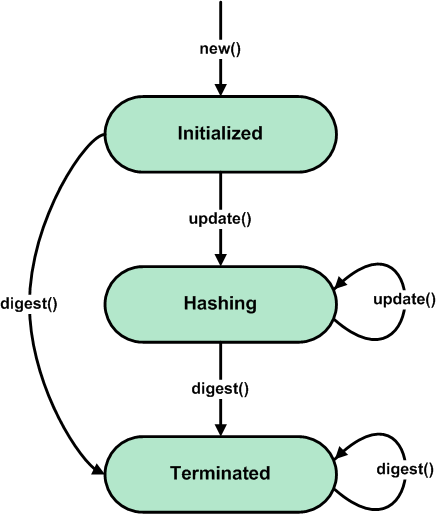

API Reference
=============

In general, the **pyssdeep** API can be divided into three parts:

- Python wrapper for functions from **fazzy.dll** libraries (for Windows) or **fuzzylib.so** (for Linux).
- API in accordance with `pep 452 <https://www.python.org/dev/peps/pep-0452/>`_. 
- Other API.

Python wrapper
--------------

Contained in the **ssdeep_wrapper.py** module. Includes wrappers for functions, data's structures and constants defined and implemented in the library **fuzzy.dll** (for the Windows operating system) or **libfuzzy.so** (for the Linux operating system). Prototypes of constants, data's structures and functions are described is `here <https://ssdeep-project.github.io/ssdeep/doc/api/html/index.html>`_ .

Data's structure
~~~~~~~~~~~~~~~~

.. function:: _blockhash_context

A **_blockhash_context** contains a signature state for a specific (implicit) blocksize. Description of the prototype is `here <https://ssdeep-project.github.io/ssdeep/doc/api/html/structblockhash__context.html>`_.

.. rubric:: Defining the structure in a module:

.. code:: python

    class _blockhash_context(ctypes.Structure):
    _fields_ = [
        ('dindex', ctypes.c_uint),
        ('digest', ctypes.c_char * _SPAMSUM_LENGTH),
        ('halfdigest', ctypes.c_char),
        ('h', ctypes.c_char),
        ('halfh', ctypes.c_char),
    ]

*****

.. function:: _roll_state

A **_roll_state** contains a rolling hash's state. This rolling hash based on the Adler checksum. Description of the prototype is `here <https://ssdeep-project.github.io/ssdeep/doc/api/html/structroll__state.html>`_.

.. rubric:: Defining the structure in a module:

.. code:: python

    class _roll_state(ctypes.Structure):
    _fields_ = [
        ('window', ctypes.c_char * _ROLLING_WINDOW),
        ('h1', ctypes.c_ulong),
        ('h2', ctypes.c_ulong),
        ('h3', ctypes.c_ulong),
        ('n', ctypes.c_ulong),
    ]

*****

.. _fuzzy_state:
.. function:: fuzzy_state

The basic data structure of a fuzzy hash. Description of the prototype is `here <https://ssdeep-project.github.io/ssdeep/doc/api/html/structfuzzy__state.html>`_.

.. rubric:: Defining the structure in a module:

.. code:: python

    class fuzzy_state(ctypes.Structure):
    _fields_ = [
        ('total_size', ctypes.c_ulonglong),
        ('fixed_size', ctypes.c_ulonglong),
        ('reduce_border', ctypes.c_ulonglong),
        ('bhstart', ctypes.c_uint),
        ('bhend', ctypes.c_uint),
        ('bhendlimit', ctypes.c_uint),
        ('flags', ctypes.c_uint),
        ('rollmask', ctypes.c_ulong),
        ('bh', _blockhash_context * _NUM_BLOCKHASHES),
        ('roll', _roll_state),
        ('lasth',ctypes.c_ubyte),
    ]

*****

Constants
~~~~~~~~~
.. _FUZZY_FLAG_ELIMSEQ:
.. _FUZZY_FLAG_NOTRUNC:

- **FUZZY_FLAG_ELIMSEQ** - flag indicating to eliminate sequences of more than  three identical characters.
- **FUZZY_FLAG_NOTRUNC** - flag indicating not to truncate the second part to **SPAMSUM_LENGTH**/2 characters.
- **_ROLLING_WINDOW** - length of a fazzy hash window (protected attribute of the module).
- **_SPAMSUM_LENGTH** - length of an individual fuzzy hash signature component (protected attribute of the module).
- **_FUZZY_MAX_RESULT** - the longest possible length for a fuzzy hash signature (protected attribute of the module).
- **_NUM_BLOCKHASHES** - the number of blochash context (protected attribute of the module).

*****

Functions
~~~~~~~~~

.. function:: fuzzy_new()

Construct an instance of the fuzzy_state_ data strukture. To use it call fuzzy_update_ and fuzzy_digest_ on it. It must be disposed with fuzzy_free_.

.. code-block:: python

    import pyssdeep

    try:
        state = pyssdeep.fuzzy_new()
    exception pyssdeep.FuzzyHashError as err
        print('Error code: {}.'.format(err))

**Returns**:
    The instance of the fuzzy_state_ data structure.

**Returns type**:
    fuzzy_state_.

**Raises**: 
    FuzzyHashError_ - If a function execution error occurred.

*****

.. function:: fuzzy_clone(state)

Create a copy of a fuzzy_state_ object. This copy can be used with fuzzy_update_ and fuzzy_digest_ independently of the original. It must be disposed with fuzzy_free_ like the original has to be cleared in this way.

.. code-block:: python

    import pyssdeep

    try:
        state = pyssdeep.fuzzy_new()
        state_clone = pyssdeep.fuzzy_clone(state)
    exception pyssdeep.FuzzyHashError as err
        print('Error code: {}.'.format(err))

**Parameters**:
    **state(** *fuzzy_state* **)** - the fuzzy_state_ object to create a copy of.

**Returns**:
    The copy of a fuzzy_state_ object.

**Returns type**:
    fuzzy_state_.

**Raises**: 
    FuzzyHashError_ - If a function execution error occurred.

*****

.. _fuzzy_update:
.. function:: fuzzy_update(state, buffer, buffer_size)

Feed the data contained in the given **buffer** to the **state**. When an error occurs, the **state** is undefined. In that case it must not be passed to any function besides fuzzy_free_.

.. code-block:: python

    import pyssdeep

    try:
        state = pyssdeep.fuzzy_new()
        pyssdeep.fuzzy_update(state, b'The massage', len(b'The message'))
    exception pyssdeep.FuzzyHashError as err
        print('Error code: {}.'.format(err))

**Parameters**:
    - **state(** *fuzzy_state* **)** - the **fuzzy_state** object.
    - **buffer(** *bytes* **)** - the data to be hashed.
    - **buffer_size(** *int* **)** - the length of the given **buffer**.

**Raises**: 
    FuzzyHashError_ - If a function execution error occurred.

*****

.. _fuzzy_digest:
.. function:: fuzzy_digest(state, flag)

Obtain the fuzzy hash from the **state**. This function does not change the **state** at all. It reports the hash for the concatenation of the data previously fed using fuzzy_update_ function.

.. code-block:: python

    import pyssdeep

    try:
        state = pyssdeep.fuzzy_new()
        pyssdeep.fuzzy_update(state, b'The massage', len(b'The message'))
        result = fuzzy_digest(state, FUZZY_FLAG_ELIMSEQ)
    exception pyssdeep.FuzzyHashError as err
        print('Error code: {}.'.format(err))

**Parameters**:
    - **state(** *fuzzy_state* **)** - the fuzzy_state_ object.
    - **flag(** *int* **)** - Is a bitwise or of FUZZY_FLAG_ELIMSEQ_ and FUZZY_FLAG_NOTRUNC_ value. The absence of flags is represented by a zero.

**Returns**:
    The fuzzy hash value.

**Returns type**:
    **string**.

**Raises**: 
    FuzzyHashError_ - If a function execution error occurred.

*****

.. function:: fuzzy_compare(signature_1, signature_2)

Compute the match score between two fuzzy hash signatures.

.. code-block:: python

    import pyssdeep

    signature_1 = '3:hRMs3FsRc2:hRpg'
    signature_2 = '3:3LSve:7ce'
    try:
        result = pyssdeep.fuzzy_compare(signature_1, signature_2)
    exception pyssdeep.FuzzyHashError as err
        print('Error code: {}.'.format(err))

**Parameters**:
    - **signature_1(** *string* **)** - the first fuzzy hash signature.
    - **signature_2(** *string* **)** - the second fuzzy hash signature.

**Returns**:
    The value from zero to 100 indicating the match score of the two signatures. A match score of zero indicates the signatures did not match.

**Returns type**:
    **int**.

**Raises**: 
    FuzzyHashError_ - If a function execution error occurred.

*****

.. _fuzzy_free:
.. function:: fuzzy_free(state)

Dispose a fuzzy_state_ object.

.. code:: python

    import pyssdeep

    try:
        state = pyssdeep.fuzzy_new()
    exception pyssdeep.FuzzyHashError as err
        print('Error code: {}.'.format(err))
    fuzzy_free(state)
    
**Parameters**:
    **state(** *fuzzy_state* **)** - the fuzzy_state_ object.

*****

.. function:: fuzzy_hash_buf(buf, buf_len)

Compute the fuzzy hash of a buffer. The computes the fuzzy hash of the first **buf_len** bytes of the **buf**.

.. code-block:: python

    import pyssdeep

    try:
        result = fuzzy_hash_buf(b'The massage', len(b'The message'))
    exception pyssdeep.FuzzyHashError as err
        print('Error code: {}.'.format(err))

**Parameters**:
    - **buf(** *bytes* **)** - the data to be fuzzy hashed.
    - **buf_len(** *int* **)** - the length of the given **buf**.

**Returns**:
    The fuzzy hash of the **buff**.

**Returns type**:
    **string**.

**Raises**:
    FuzzyHashError_ - If a function execution error occurred.

*****

.. function:: fuzzy_hash_filename(filename)

Compute the fuzzy hash of a file. Opens, reads, and hashes the contents of the file **filename**.

.. code-block:: python

    import pyssdeep

    try:
        result = fuzzy_hash_filename('file.txt')
    exception pyssdeep.FuzzyHashError as err
        print('Error code: {}.'.format(err))

**Parameters**:
    **filename(** *string* **)** - the file to be hashed.

**Returns**:
    The fuzzy hash of the file.

**Returns type**:
    **string**.

**Raises**:
    FuzzyHashError_ - If a function execution error occurred.

*****

.. function:: fuzzy_set_total_input_length(state, total_fixed_length)

If we know the file size to compute fuzzy digest, we can boost computation by restricting range of blocksize.

.. code-block::

    import pyssdeep

    try:
        state = fuzzy_new()
        fuzzy_set_total_input_length(state, 1024)
    exception pyssdeep.FuzzyHashError as err
        print('Error code: {}.'.format(err))

**Parameters**:
    - **state(** *fuzzy_state* **)** - the fuzzy_state_ object.
    - **total_fixed_length(** *int* **)** - total length of the data to generate digest (in the range from 0 to 18446744073709551615).

**Raises**:
    FuzzyHashError_ - If a function execution error occurred.

*****

Exception
~~~~~~~~~

.. _FuzzyHashError:
.. function:: FussyHashError

The base exception class.

*****

API in accordance with pep 452
------------------------------

This part of the API implements fuzzy hash calculation according to the principles defined in `pep 452 <https://www.python.org/dev/peps/pep-0452/>`_. It includes the new_ function and the FuzzyHash_ classe.

API principles
~~~~~~~~~~~~~~

    Generic state diagram for a fuzzy hash object

The first message fragment for the hash can be passed to the new_ function with the **data** parameter:

.. code-block::

    >>> import pyssdeep
    >>> fuzzy_hash_object = pyssdeep.new(data='The first message fragment')
    >>> 

The **data** argument is optional and may be not passed to the new_ function. In this case, the **data** argument must be passed in the update_ method of the FuzzyHash_ class, which is called after new_:

.. code-block::

    >>> import pyssdeep
    >>> fuzzy_hash_object = pyssdeep.new()
    >>> fuzzy_hash_object.update('The first message fragment')
    >>>

After that, the update_ method can be called any number of times as needed, with other parts of the message.

Passing the first part of the message to the new_ function, and the subsequent parts to the update_ method:

.. code-block::

    >>> import pyssdeep
    >>> fuzzy_hash_object = pyssdeep.new(data='The first message fragment')
    >>> fuzzy_hash_object.update('The second message fragment')
    >>>

Passing the first part of the message and subsequent parts to the update_ method:

.. code-block::

    >>> import pyssdeep
    >>> fuzzy_hash_object = pyssdeep.new()
    >>> fuzzy_hash_object.update('The first message fragment')
    >>> fuzzy_hash_object.update('The second message fragment')
    >>> fuzzy_hash_object.update('The third message fragment')
    >>>

Hash calculation is completed using the digest_ or method:

.. code-block::

    >>> import pyssdeep
    >>> fuzzy_hash_object = pyssdeep.new()
    >>> fuzzy_hash_object.update('The first message fragment')
    >>> fuzzy_hash_object.update('The second message fragment')
    >>> fuzzy_hash_object.update('The third message fragment')
    >>> fuzzy_hash_object.digest()
    '3:SMGjIAhGb/xxAGeRECGb/x2NWkzDCGb/n:Tl/A7REtA7vt/'
    >>> 

*****

Function
~~~~~~~~

.. _new:
.. function:: new(**kwargs)

Create a new hashing object and return it.

.. code-block:: python

    import pyssdeep

    try:
        fuzzy_hash_object = pyssdeep.new(data='The message', encoding='ascii')
    except pyssdeep.FuzzyHashError as err:
        print(err)
    excrpt TypeError as err:
        print(err)

**Parameters**:
    - **\*\*data(** *string* or *bytes* **)** - the data from which to get the fuzzy hash. If this argument is passed to a function, you can immediately use the digest_ method to calculate the fuzzy hash value after calling new_.  If the argument is not passed to the function, then you must use the update_ method before the digest_ method.
    - **\*\*encoding(** *string* **)** - is used if **data** is string (default value is "utf-8").

**Returns**:
    New hash object.

**Returns type**:
    FuzzyHash_ class.

**Raises**:
    - **TypeError**: If a argument type is incorrect.
    - FuzzyHashError_: If a function execution error occurred or if the **encoding** value is incorrect.

.. _FuzzyHash:

FuzzyHash class
~~~~~~~~~~~~~~~

Methods:
++++++++

.. _update:
.. method:: update(data, encoding)

Update the hash object with **data**.

.. code-block:: python

    import pyssdeep

    try:
        fuzzy_hash_object = pyssdeep.new(data='The first message fragment', encoding='ascii')
        fuzzy_hash_object.update('The second message fragment', 'ascii')
    except pyssdeep.FuzzyHashError as err:
        print(err)
    excrpt TypeError as err:
        print(err)

**Parameters**:
    - **data(** *string* or *bytes* **)** - the data from which to get the hash.
    - **encoding(** *string* **)** - is used if **data** is string (default value is "utf-8").

**Raises**:
    - **TypeError**: If a argument type is incorrect.
    - FuzzyHashError_: If a function execution error occurred or if the **encoding** value is incorrect.

*****

.. _digest:
.. method:: digets()

Obtain the fuzzy hash. It reports the hash for the concatenation of the data previously fed using update_ method.

.. code-block:: python

    import pyssdeep

    try:
        fuzzy_hash_object = pyssdeep.new(data='The message', encoding='ascii')
        result = fuzzy_hash_object.digest()
    except pyssdeep.FuzzyHashError as err:
        print(err)
    excrpt TypeError as err:
        print(err)

**Parameters**:
    **flag(** *int* **)** - is a bitwise or of FUZZY_FLAG_ELIMSEQ_ and FUZZY_FLAG_NOTRUNC_ value (default value is zero).

**Returns**:
    Fuzzy hash value.

**Returns type**:
    **string**.

**Raises**:
    **TypeError**: If a argument type is incorrect.
    FuzzyHashError_: If a function execution error occurred.

*****

.. _copy:
.. method:: copy()

Create the copy of the hash object. The copy of of the hash object can be used with **update** and **digest** independently of the original.

.. code-block:: python

    import pyssdeep

    try:
        fuzzy_hash_object = pyssdeep.new(data='The message', encoding='ascii')
        fuzzy_hash_object_copy = fuzzy_hash_object.copy()
    except pyssdeep.FuzzyHashError as err:
        print(err)
    excrpt TypeError as err:
        print(err)

**Returns**:
    Copy of the hash object.

**Returns type**:
    FuzzyHash_ class.

**Raises**:
    FuzzyHashError_: If a function execution error occurred.

*****

Attributes:
+++++++++++

.. _block_size:
.. attribute:: block_size

The block size value used to compute fuzzy hash.

.. code-block::

    >>> import pyssdeep
    >>> fuzzy_hash_object = pyssdeep.new(data='The message')
    >>> fuzzy_hash_object.block_size
    3
    >>> 
    
**Raises**:
    FuzzyHashError_: If the block size value cannot be returned.

*****

.. _digest_size:
.. attribute:: digest_size

The digest size value.

.. code-block::

    >>> import pyssdeep
    >>> fuzzy_hash_object = pyssdeep.new(data='The message')
    >>> fuzzy_hash_object.digest_size
    15
    >>> 
    
**Raises**:
    FuzzyHashError_: If the block size value cannot be returned.

*****

.. _name:
.. attribute:: name

The string with the name of the hashing algorithm. This value is "ssdeep".

.. code-block::

    >>> import pyssdeep
    >>> fuzzy_hash_object = pyssdeep.new(data='The message')
    >>> fuzzy_hash_object.name
    'ssdeep'
    >>> 
    
**Raises**:
    FuzzyHashError_: If the block size value cannot be returned.

*****

Other API
---------

Functions
~~~~~~~~~

.. function:: compare(signature_1, signature_2)

Compare two fazzy hash signatures.

.. code-block::

    import pyssdeep

    try:
        result = pyssdeep.compare(
            '3:hRMs3FsRc2:hRpg',
            '3:3LSve:7ce'
        )
    except pyssdeep.FuzzyHashError as err:
        print(err)
    excrpt TypeError as err:
        print(err)
    print(result)

**Parameters**:
    - **signature_1(** *string* **)** - the first fuzzy hash signature.
    - **signature_2(** *string* **)** - the second fuzzy hash signature.

**Returns**:
    The value from zero to 100 indicating the match score of the two fuzzy hash signatures. A match score of zero indicates the signatures did not match. 

**Returns type**:
    **int**.

**Raises**:
    - **TypeError**: If a argument type is incorrect.
    - FuzzyHashError_: If a function execution error occurred.

*****

.. function:: get_hash_file(file_name)

Compute the fuzzy hash of a file.

.. code-block:: python

    import pyssdeep

    try:
        result = pyssdeep.get_hash_file('e:/file.txt')
    except pyssdeep.FuzzyHashError as err:
        print(err)
    except IOError as err:
        print(err)
    print(result)

**Parameters**:
    **file_name(** *string* **)** - the file to be hashed.

**Returns**:
    The fuzzy hash of the file.

**Returns type**:
    **string**.

**Raises**:
    - **IOError**: If the file is not found or unavailable.
    - FuzzyHashError_: If a function execution error occurred.    

*****

.. function:: get_hash_buffer(buffer, encoding)

Compute the fuzzy hash of a buffer.

.. code-block:: python

    import pyssdeep

    try:
        result = pyssdeep.get_hash_buffer('The message', 'ascii')
    except pyssdeep.FuzzyHashError as err:
        print(err)
    except TypeError as err:
        print(err)
    print(result)

**Parameters**:
    - **byffer(** *string* or *bytes* **)** - the data from which to get the hash.
    - **encoding(** *string* **)** - is used if **buffer** is string (default value is "utf-8").

**Returns**:
    The fuzzy hash of the buffer.

**Returns type**:
    **string**.

**Raises**:
    **TypeError**: If a argument type is incorrect.
    FuzzyHashError_: If a function execution error occurred or if the **encoding** value is incorrect.

